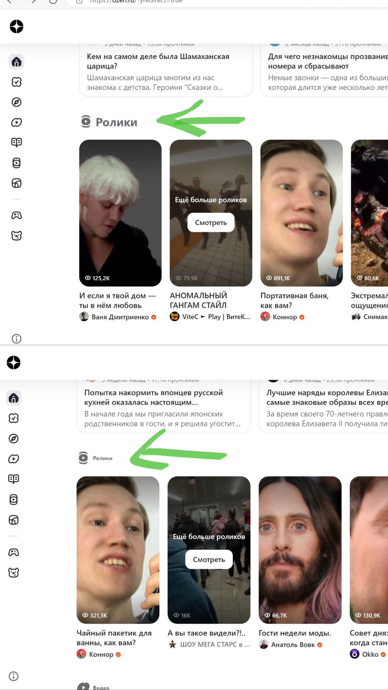
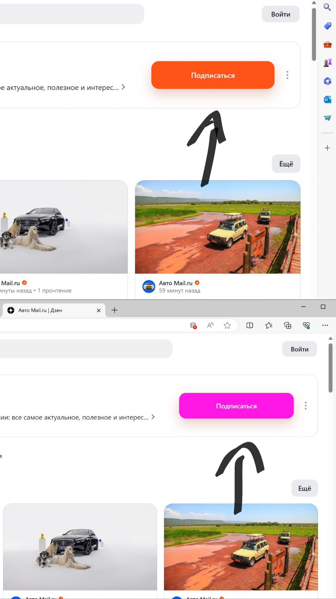
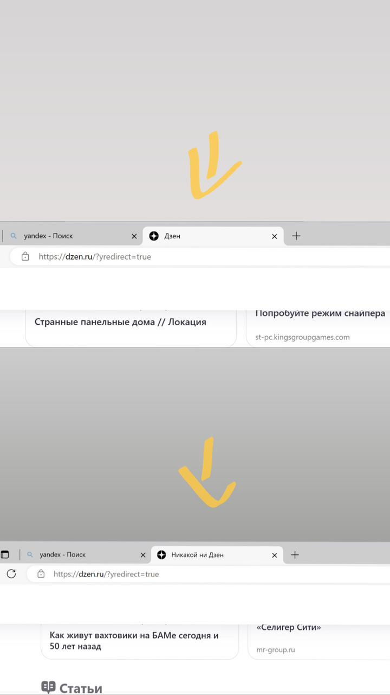
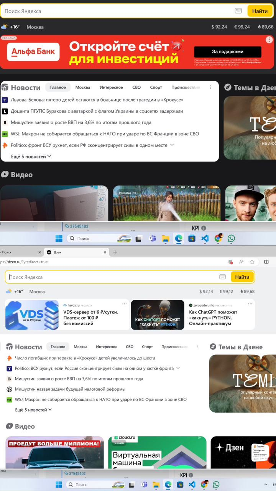
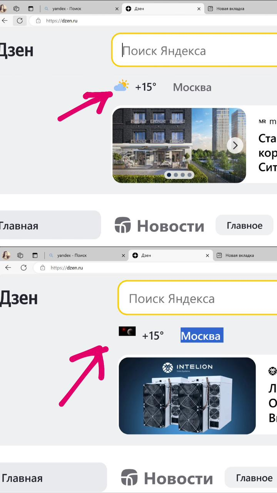
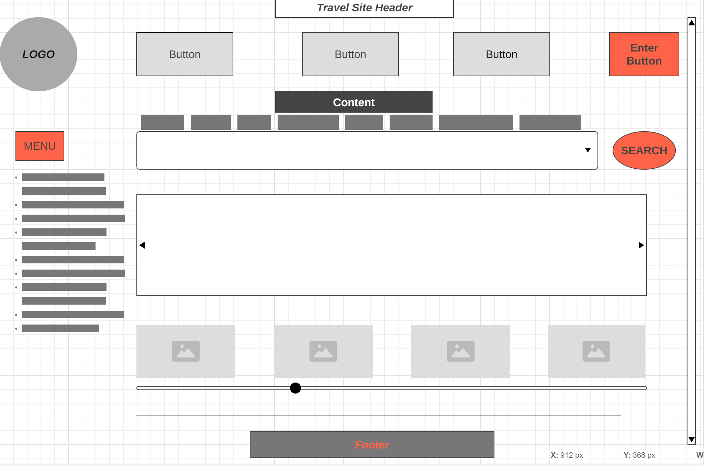

# Урок 2. Семинар. Веб-технологии

 ### 1.  На основе сайта ***yandex.ru*** определите, на каком протоколе работает сайт.

```
Подключение защищено протоколом https:
```


### 2. Проанализируйте структуру страницы сайта ***yandex.ru***.

```
Шапка сайта:

Логотип
Навигационные ссылки (Главная, Новости, Статьи...)
Поисковая строка
Кнопка входа/регистрации

Главная страница:

Рекламные баннеры
Блоки новостей
Блок с популярными статьями или видео
Разделы сайта (подкатегории)

Страница новостей:

Список новостей с заголовками и кратким описанием
Фильтры и сортировка новостей
Возможность комментирования новостей
Страница статей:

Список статей с заголовками и кратким описанием
Возможность фильтрации и сортировки статей
Возможность добавления статьи в избранное

Страница видео:

Плеер для просмотра видео
Список видеороликов с описанием
Возможность сортировки видео по категориям

Страница "О нас":

Информация о сайте и его назначении
Контактная информация
Правила пользования и политика конфиденциальности

Футер сайта (расположен слева, под меню):

Ссылки на социальные сети
Контактная информация
Кнопки для подписки на рассылку новостей
```
### 3. Внесите не менее 10 изменений на страницу с помощью инструмента разработчика и представьте скриншоты было/стало.

* Change № 1 (rabbit)


* Сhange № 2 (colour)


* Change № 3 (space)


* Change № 4 (font-size)



* Change № 5 (search-input-position)


* Change № 6 (subscribe-colour)



* Change № 7 (why_subscribe)


* Change № 8 (dzen)



* Change № 9 (theme_colour)



* Change № 10 (logo_change)



### 4. Создайте прототип низкой детализации.



* [WireFrame.cc link](https://wireframe.cc/g2mebA)